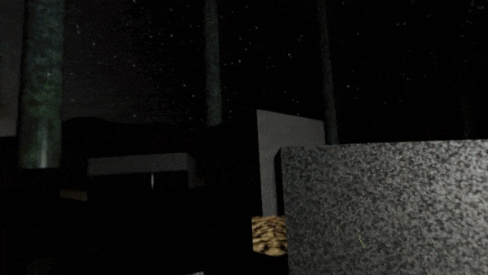
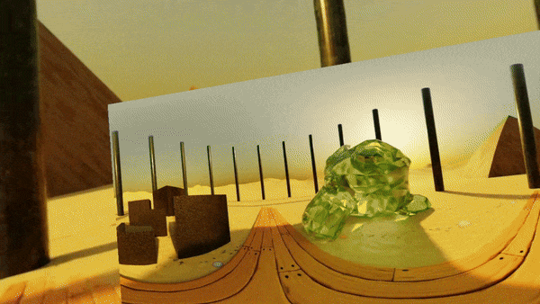

# Godot 360 video player

This is an example project showing how to reproduce 360 videos with an HMD. This only accept .ogv files as this is the codec accepted in Godot base code.

It features a modified version of the viewport_2d_in_3d node, using an spherical mesh.

It also features a flat videoplayer and a filedialog to navigate and load more videos (it only read ogv)

# File dialog in XR

This project uses the filedialog node from godot to navigate and select folders, but there is no current implementation for double click in a dialog in the current XR-Tools version. To run this project you need to install an alternative branch for XR Tools, until PR is accepted.

[https://github.com/GodotVR/godot-xr-tools/pull/558](https://github.com/GodotVR/godot-xr-tools/pull/558)

# How to Install alternate xr tools

This project is made in Godot 4.3

Clone this repo as usual and before open it in godot, open a terminal an run the following commands.

    mkdir addons
    cd addons
    git clone https://github.com/surreal6/godot-xr-tools.git --branch pointer-doubleclick godot-xr-tools-surreal
    cp -r godot-xr-tools-surreal/addons/godot-xr-tools ./godot-xr-tools
    rm -r godot-xr-tools-surreal

# License

All the code is GPL

The 360 video sample is CC-NC-SA-by Carlos Padial 2024